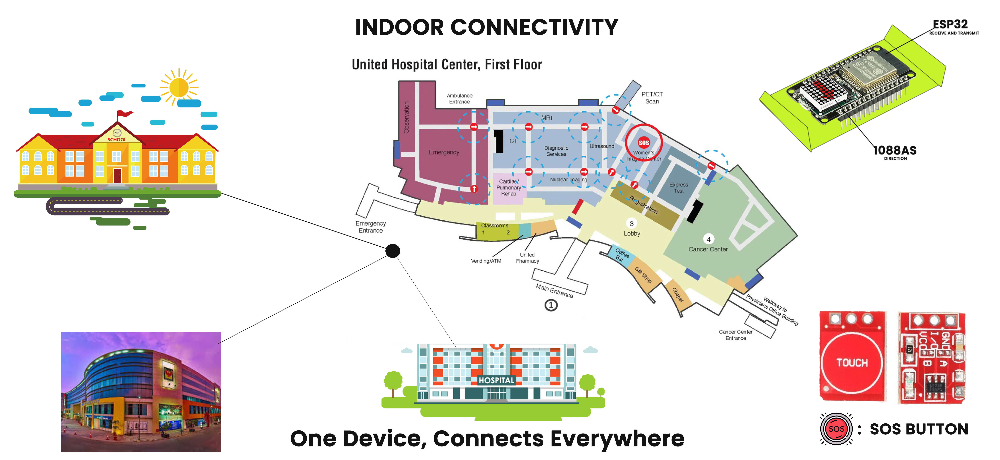
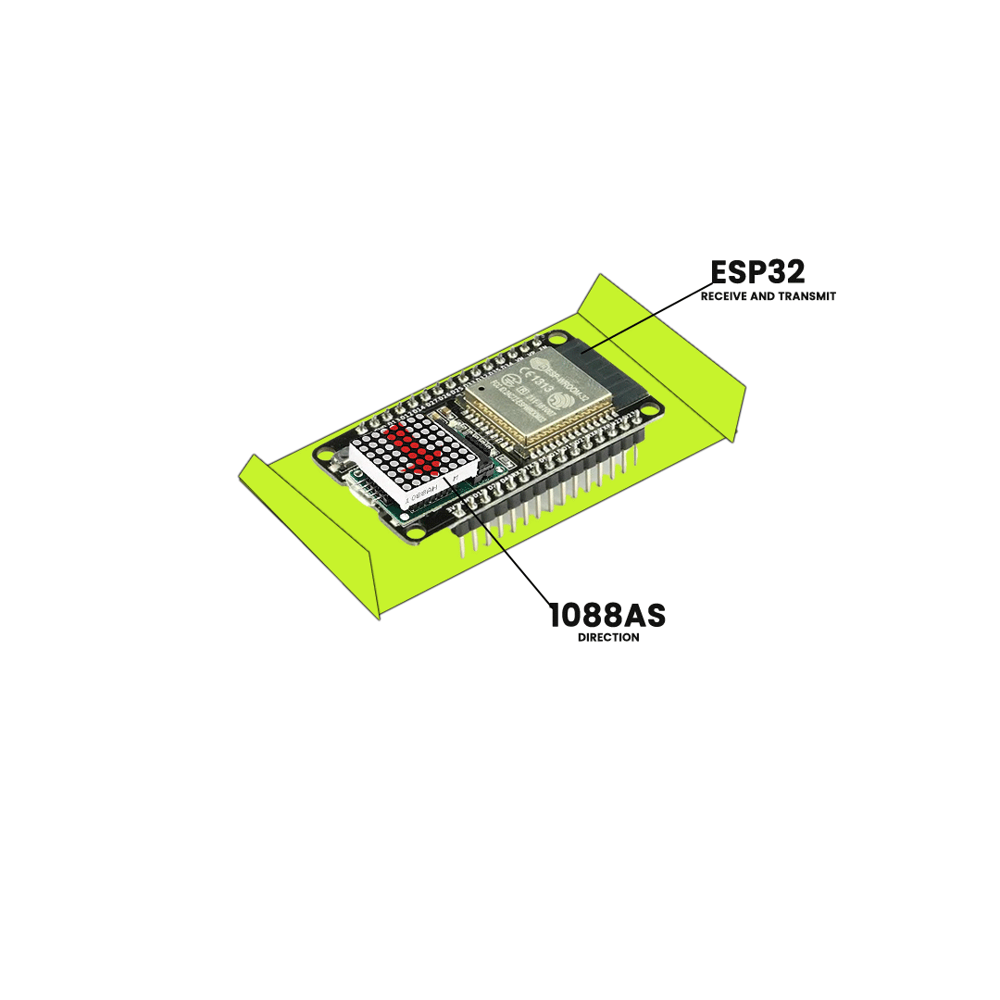

# Women-Safety-Protecting-Women-from-safety-threats

## Problem Statement (PS) Number: SIH1605

### Description

We are developing a **simulation** to demonstrate an innovative **indoor SOS system** designed to enhance women’s safety in workplaces. This system integrates real-time monitoring, analytics, and a physical SOS device to provide a comprehensive safety solution:

- **Real-time Monitoring & Analytics**: Using **Caffe models** for person detection and gender classification (via `gender_net.caffemodel`, `age_net.caffemodel` with respective prototxt files), the system identifies the number of men and women present in the scene. In the event of a woman being surrounded by men, the system triggers immediate alerts for faster intervention.
- **SOS Button Activation**: Upon pressing the SOS button, nearby Bluetooth-connected LED panels light up with directional arrows pointing to the woman's location, enabling quick identification and assistance.
- **Accountability & Prevention**: Cameras (as demonstrated in the simulation with `opencv_face_detector` models) and microphones capture real-time footage and audio to prevent misuse and ensure accountability.

This simulation presents a practical solution for enhancing workplace safety, providing both proactive and responsive measures to ensure women’s safety indoors.

---

### Technical Approach

#### Hardware Pre-requisites:

- ESP8266
- BLE Module
- ESP32 Cam Module
- Buzzer
- LED
- Switch

#### Software Resources:

- **Caffe Models**:
  - `gender_net.caffemodel` and `gender_deploy.prototxt` for gender classification.
  - `age_net.caffemodel` and `age_deploy.prototxt` for additional age-related data.
- **OpenCV Face Detector**:
  - `opencv_face_detector_uint8.pb` and `opencv_face_detector.pbtxt` for face detection.

#### Software Functioning:

1. **Real-time Monitoring**: Using **Caffe-based models** for gender and person detection, the system identifies high-risk situations. If a woman is surrounded by men, alerts are triggered for immediate assistance.
2. **SOS Button Activation**: Pressing the SOS button triggers a siren and lights up Bluetooth-enabled LED arrows, directing responders to the woman’s location.

---

### Social Impact

- **Faster Response**: Immediate detection of high-risk situations allows for quicker, life-saving interventions.
- **Empowerment**: Women can feel safer knowing there’s a reliable tool available to assist them when needed.

---

### Visuals

#### Indoor Connectivity

#### ESP32 Module

---
